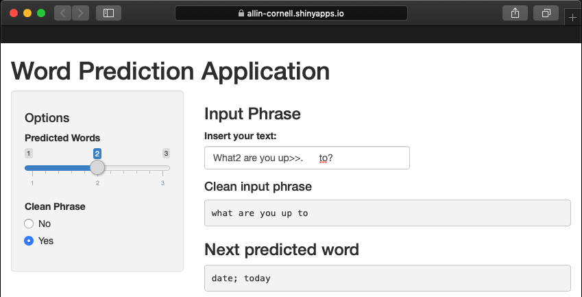
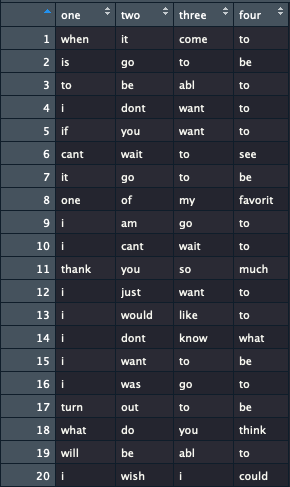
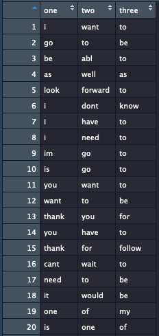

## Description
The application predicts the most likely word(s) to follow a given text.

### Location
https://allin-cornell.shinyapps.io/application/

### Features

- large and various training datasets 
- fast and efficient algorithms

### Interface

- simple and attarctive layout
- easy-to-use and self-explanatory
- user-friendly and reactive

---
## Application Interface

    

### Options
- Predicted Words = choose how many top predicted words to show: 1/2/3
- Clean Phrase = choose whether to show the raw cleaned processed input: Yes/No

### Outputs
- Clean Input Phrase = show the raw cleaned processed input phrase
- Next Predicted Word = show the top most likely predicted next word

---
## Raw Data

The data used in to train the predictive algorithm SwiftKey from several sources:
- Twitter: "/en_US/en_US.twitter.txt"
- Blogs: "/en_US/en_US.blogs.txt"
- News: "/en_US/en_US.news.txt"

### Processing data 
- Create a common dataset with all texts from all datas ources
- Clean data by removing: sopaces, numbers, punctuations, etc.
- Select samples of 50,000-texts subsets from the datasets
- Create: bigrams, trigrams, quadrigrams from each sample 
- Order: bigrams, trigrams, quadrigrams by their appearance frequency in the dataset

#### NOTE: bigrams, trigrams, quadrigrams are groups of consecutive 2, 3, or 4 words

---

## Processed Data
### The top 20 most frequent quadrigrams, trigrams and bigrams

    
    
    

### How it works
- Find last 3, 2 or 1 word(s) of the cleaned input phrase 
- Find matches with the first 3, 2, 1 words in the quadrigrams, trigrams, bigrams (if available)
- Output the most frequent last word of the respective quadrigrams, trigrams, bigrams
